<div align="center">

# Rising Tides Starter Pack

**From zero to a fully-configured Claude Code environment in one command.**

[](SECURITY.md)
[](skills/)
[](plugins/)
[](MCP_REGISTRY.md)
[](LICENSE)

*A curated, security-audited collection of Claude Code skills from the open-source community.*

[Quick Start](#one-command-setup) | [Security](#security-audit) | [Attribution](#attribution--credits) | [Community](https://www.skool.com/rising-tides-9034)

</div>

---

## What You're Getting

The Rising Tides system uses **progressive disclosure** — you don't load all skills into context. Claude discovers what's available through a lightweight index and loads full skill content only when needed.

```
┌─────────────────────────────────────────────────────────────────────────┐
│                         RISING TIDES PACK                               │
├─────────────────────────────────────────────────────────────────────────┤
│   170 Skills    │  Marketing, Frontend, Backend, Security, DevOps      │
│    37 Plugins   │  Bundled skill + MCP packages                        │
│     9 CLIs      │  gh, stripe, vercel, firebase, supabase...           │
│    17 MCPs      │  context7, playwright, github, remotion...           │
└─────────────────────────────────────────────────────────────────────────┘
```

### Skill Categories

| Category | Skills | What You Get |
|----------|--------|--------------|
| **Security** | 24 | Auditing, YARA rules, Semgrep, smart contracts, OWASP patterns |
| **Frontend** | 18 | React, Vue, Angular, TypeScript, design systems |
| **Backend** | 22 | Django, FastAPI, Spring Boot, NestJS, Rails, Laravel |
| **DevOps** | 15 | Kubernetes, Terraform, Docker, CI/CD, GitOps |
| **Marketing** | 23 | Copywriting, SEO, CRO, analytics, email sequences |
| **Architecture** | 12 | C4 diagrams, API design, microservices, cloud |
| **Documentation** | 11 | READMEs, Mermaid, presentations, Office docs |
| **Workflow** | 14 | Git, debugging, handoffs, requirements |
| **Languages** | 31+ | Python, Go, Rust, C++, Java, Kotlin, Swift, and more |

---

## Architecture


**You stay at project level.** You reach UP to the global library when needed, pull DOWN what helps.

### Progressive Disclosure (Context Efficiency)

| What | Tokens | When Loaded |
|------|--------|-------------|
| Skill descriptions | ~100 per skill | Session start |
| Full SKILL.md content | 500-2000 per skill | On invoke only |
| MCP tool schemas | ~500 per tool | On-demand (with Tool Search) |

**You're paying ~6% context for all 170 skills.** Full content loads only when you actually invoke a skill.

---

## One-Command Setup

### Mac

Open Terminal and run:

```bash
curl -fsSL https://raw.githubusercontent.com/SunsetSystemsAI/rising-tides-starter/main/scripts/setup-mac.sh -o /tmp/setup.sh && bash /tmp/setup.sh
```

> **Do NOT use `sudo`.** The script will ask for your password when needed.

### Windows

Open PowerShell **as Administrator** and run:

```powershell
Set-ExecutionPolicy Bypass -Scope Process -Force
[Net.ServicePointManager]::SecurityProtocol = [Net.SecurityProtocolType]::Tls12
Invoke-WebRequest -Uri 'https://raw.githubusercontent.com/SunsetSystemsAI/rising-tides-starter/main/scripts/setup-windows.ps1' -OutFile "$env:TEMP\setup-windows.ps1"
& "$env:TEMP\setup-windows.ps1"
```

### Linux / WSL2

```bash
curl -fsSL https://raw.githubusercontent.com/SunsetSystemsAI/rising-tides-starter/main/scripts/setup-linux.sh -o /tmp/setup.sh && bash /tmp/setup.sh
```

---

## After Setup

The only manual step is authentication:

```bash
claude auth login
```

Then you're ready:

```bash
claude
```

### Get Skill Recommendations

In any project, run:

```
/recommend skills
```

Claude analyzes your project and shows which skills to import (and which to skip).

### Or Try Skills Directly

```
/copywriting write a headline for my productivity app
/react-dev create a login form component
/security-audit check this codebase for vulnerabilities
```

---

## Security Audit

<div align="center">

### Security Status: PASSED

</div>

We take security seriously. Every skill and script in this collection has been audited.


### What We Scanned

| Category | Count | Status |
|----------|-------|--------|
| Skill directories | 170 | ✅ Passed |
| Plugin directories | 37 | ✅ Passed |
| Shell scripts | 4 | ✅ Fixed |
| Python scripts | 76 | ✅ Reviewed |
| MCP configurations | 14 | ✅ Verified |
| **Total files** | **1,012+** | **✅ Audited** |

### Security Checks Performed

| Check | Result |
|-------|--------|
| Hardcoded API keys | ✅ None found |
| Malicious URLs | ✅ All official sources only |
| Data exfiltration code | ✅ None found |
| Command injection patterns | ✅ Fixed (2 instances) |
| Privilege escalation | ✅ Only in install docs |
| Unsafe file operations | ✅ None found |
| MCP over-permissions | ✅ Minimal permissions used |

### Community Repository Audit

We also audited 16 community repositories before including any skills:

| Verdict | Count | Outcome |
|---------|-------|---------|
| **Approved** | 10 repos | Included in collection |
| **Rejected** | 6 repos | Not included |

**Rejection reasons included:** telemetry uploading user data, unauditable binaries, `bypassPermissions` flags, and unsafe curl-to-bash patterns.

### Security Model

```mermaid
graph TB
    subgraph Safe["LOW RISK — Human Readable"]
        Skills["Skills<br/>SKILL.md files"]
        Docs["Documentation<br/>*.md files"]
        Index["Index files<br/>JSON catalogs"]
    end

    subgraph Trust["HIGHER RISK — Executable"]
        MCP["MCP Servers<br/>Run as processes"]
        NPX["npx packages<br/>Downloaded at runtime"]
    end

    Skills --> |"Auditable"| Review["You can read<br/>every line"]
    MCP --> |"Verified"| Approved["Only approved<br/>MCPs listed"]

    style Safe fill:#c8e6c9
    style Trust fill:#fff3e0
```



**Skills are safe by design** — they're just markdown files you can read and audit yourself.

**MCPs require trust** — we only include MCPs from verified publishers (Anthropic, Upstash, Microsoft).

📄 **[Full Security Report](SECURITY-AUDIT-SKILLS.md)** | **[Community Audit](SECURITY-AUDIT-COMMUNITY-REPOS.md)**

---

## Attribution & Credits

<div align="center">

### Standing on the Shoulders of Giants

*This collection curates and packages skills from the open-source community.*
*All credit goes to the original authors.*

</div>

We believe in giving credit where it's due. This pack wouldn't exist without the incredible work of these contributors:

### Original Skill Sources

| Source | Skills | Focus Area | License |
|--------|--------|------------|---------|
| **[Trail of Bits](https://github.com/trailofbits/skills)** | 24 | Security auditing, YARA, Semgrep, smart contracts | Apache-2.0 |
| **[Corey Haines](https://github.com/coreyhaines31/marketingskills)** | 23 | Marketing, SEO, CRO, copywriting | MIT |
| **[Jeff Allan](https://github.com/Jeffallan/claude-skills)** | 60+ | Languages, frameworks, architecture | MIT |
| **[Softaworks](https://github.com/softaworks/agent-toolkit)** | 40 | Dev workflow, architecture, communication | MIT |
| **[harperaa](https://github.com/harperaa/secure-claude-skills)** | 11 | Next.js security patterns (OWASP) | MIT |
| **[Vercel Labs](https://github.com/vercel-labs/agent-skills)** | 3 | React, web design | MIT |
| **[Ahmed Asmar](https://github.com/ahmedasmar/devops-claude-skills)** | 6 | DevOps, SRE, Kubernetes | MIT |
| **[Chris Wiles](https://github.com/ChrisWiles/claude-code-showcase)** | 5 | Claude Code patterns, hooks | MIT |
| **[rknall](https://github.com/rknall/claude-skills)** | 6 | Docker, GitLab stack | MIT |
| **[Anton Babenko](https://github.com/antonbabenko/terraform-skill)** | 1 | Terraform IaC | Apache-2.0 |
| **[obra/superpowers](https://github.com/obra/superpowers)** | 1 | Debugging methodology | MIT |
| **[lackeyjb](https://github.com/lackeyjb/playwright-skill)** | 1 | Playwright testing | MIT |
| **Anthropic** | 13 | Built-in Claude Code skills | Apache-2.0 |

### MCP Server Sources

| MCP | Publisher | Repository |
|-----|-----------|------------|
| memory | Anthropic | [modelcontextprotocol/servers](https://github.com/modelcontextprotocol/servers) |
| playwright | Anthropic | [anthropics/mcp-servers](https://github.com/anthropics/mcp-servers) |
| github | Anthropic | [anthropics/mcp-servers](https://github.com/anthropics/mcp-servers) |
| remotion | Anthropic | [anthropics/mcp-servers](https://github.com/anthropics/mcp-servers) |
| context7 | Upstash | [upstash/context7](https://github.com/upstash/context7) |
| shadcn | shadcn | [shadcn/ui](https://github.com/shadcn/ui) |
| docker | ckreiling | [ckreiling/mcp-server-docker](https://github.com/ckreiling/mcp-server-docker) |
| github-actions | ko1ynnky | [ko1ynnky/github-actions-mcp-server](https://github.com/ko1ynnky/github-actions-mcp-server) |

### Our Contribution

**What we did:**
- Curated 170 skills from 15+ sources
- Performed security audits on all code
- Created unified SKILLS_INDEX.json for efficient discovery
- Built 37 plugins bundling skills with MCPs
- Wrote one-command installers for all platforms
- Documented everything

**What we didn't do:**
- Write most of the skills (we're curators, not creators)
- Claim ownership of community work
- Remove attribution from original sources

📄 **[Full Attribution List](ATTRIBUTION.md)**

---

## File Locations After Install

```
~/.claude/                          # GLOBAL LIBRARY
├── skills/                         # All skills
│   ├── react-dev/
│   │   └── SKILL.md
│   ├── security-audit/
│   │   └── SKILL.md
│   └── ... (170 folders)
├── plugins/                        # Plugin bundles
│   ├── react-dev-plugin/
│   └── ... (37 folders)
├── SKILLS_INDEX.json               # Master skill catalog
├── MCP_REGISTRY.md                 # MCP configurations
├── ATTRIBUTION.md                  # Credit to original authors
└── SECURITY.md                     # Security documentation

your-project/                       # PROJECT LEVEL (where you work)
├── .claude/skills/                 # Skills pulled from global
└── .mcp.json                       # Project MCP config
```

---

## MCP Configuration

MCPs are configured **per-project** to minimize context overhead.

**Only Memory MCP should be global** — it stores persistent knowledge across all projects.

### Setting Up Memory MCP

```bash
claude mcp add memory --scope user
```

### Project-Level MCPs

When you run `/recommend skills` and confirm plugin imports, MCPs are configured automatically.

Or configure manually:

```bash
claude mcp add context7 --scope project
claude mcp add playwright --scope project
```

---

## Verification

After setup, verify your installation:

```bash
# Check versions
node --version       # Should be 18+
claude --version     # Should return version

# Check skills installed
ls ~/.claude/skills | wc -l  # Should be 170+

# Check index file
cat ~/.claude/SKILLS_INDEX.json | head

# Check Tool Search enabled
echo $ENABLE_TOOL_SEARCH  # Should be "true"
```

---

## Troubleshooting

### Script fails or stops partway on Mac

Clean up and retry:

```bash
curl -fsSL https://raw.githubusercontent.com/SunsetSystemsAI/rising-tides-starter/main/scripts/cleanup-mac.sh -o /tmp/cleanup.sh && bash /tmp/cleanup.sh
```

### "command not found: claude" after install

Close and reopen your terminal, then try again.

### Skills not loading

```bash
ls ~/.claude/skills | wc -l  # Should be 170+
cat ~/.claude/SKILLS_INDEX.json | head
```

### MCPs not working

```bash
claude mcp list
export ENABLE_TOOL_SEARCH=true
```

---

## Optional: Anthropic Enterprise Plugins

After setup, you can also install Anthropic's enterprise knowledge-work plugins:

```bash
claude plugins add knowledge-work-plugins/productivity
claude plugins add knowledge-work-plugins/sales
claude plugins add knowledge-work-plugins/data
```

These cover sales, legal, finance, and product management — complementing Rising Tides' developer-focused skills.

---

## Community & Support

<div align="center">

[](https://www.skool.com/rising-tides-9034)
[](https://github.com/SunsetSystemsAI/rising-tides-starter/issues)
[](https://github.com/SunsetSystemsAI/rising-tides-pack)

</div>

- **Community:** [Rising Tides on Skool](https://www.skool.com/rising-tides-9034) — Get help, share wins
- **Issues:** [GitHub Issues](https://github.com/SunsetSystemsAI/rising-tides-starter/issues)
- **Skills Pack:** [Rising Tides Pack](https://github.com/SunsetSystemsAI/rising-tides-pack)

---

## License

This collection is MIT licensed. Individual skills retain their original licenses (MIT or Apache-2.0).

See [ATTRIBUTION.md](ATTRIBUTION.md) for per-skill license information.

---

<div align="center">

*From zero to Claude Code pro in one command.*

**A Rising Tide Lifts All Boats**

</div>
