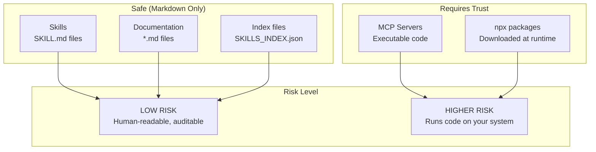

# Security Policy

This document outlines the security model for the Global Skills System and provides an audit trail for all included components.

---

## Security Model



### Understanding the Risk Levels

| Component | Type | Risk | Why |
|-----------|------|------|-----|
| **Skills** | Markdown | LOW | Plain text instructions - you can read every line |
| **Documentation** | Markdown | LOW | No executable content |
| **Index files** | Markdown | LOW | Just lists and references |
| **MCP Servers** | Executable | MEDIUM-HIGH | Run as separate processes with system access |
| **npx packages** | Downloaded code | MEDIUM-HIGH | Fetched and executed at runtime |

---

## Skill Security

### What Skills Can Do

Skills are **instruction files only**. They:
- Tell Claude how to behave
- Provide domain expertise
- Guide workflows and outputs

Skills **cannot**:
- Execute code directly
- Access files on their own
- Make network requests
- Install anything

### How to Audit a Skill

1. Open the `SKILL.md` file in any text editor
2. Read the content - it's all human-readable markdown
3. Look for the `## Rules` section to understand behavior
4. Check `ATTRIBUTION.md` for the original source

### Skills Review Checklist

All skills in this collection have been reviewed for:
- [ ] No shell injection patterns
- [ ] No credential exposure
- [ ] No harmful automation instructions
- [ ] Clear documentation of purpose
- [ ] Attributed to known source

---

## MCP Security

### What MCPs Can Do

MCPs are **executable server processes**. They:
- Run on your system with your user permissions
- Can access files, network, and system resources
- Communicate with Claude via the MCP protocol

### Approved MCPs Registry

Only use MCPs from verified sources. Here are the approved MCPs for this system:

| MCP | npm Package | Source Repository | Maintainer |
|-----|-------------|-------------------|------------|
| **memory** | `@modelcontextprotocol/server-memory` | [github.com/modelcontextprotocol/servers](https://github.com/modelcontextprotocol/servers) | Anthropic |
| **context7** | `@upstash/context7-mcp` | [github.com/upstash/context7](https://github.com/upstash/context7) | Upstash |
| **playwright** | `@playwright/mcp` | [github.com/anthropics/mcp-servers](https://github.com/anthropics/mcp-servers) | Anthropic |
| **github** | `@anthropic-ai/mcp-server-github` | [github.com/anthropics/mcp-servers](https://github.com/anthropics/mcp-servers) | Anthropic |
| **remotion** | `@anthropic-ai/mcp-server-remotion` | [github.com/anthropics/mcp-servers](https://github.com/anthropics/mcp-servers) | Anthropic |

### Before Installing an MCP

1. **Verify the package name** matches exactly what's listed above
2. **Check the npm page** at `npmjs.com/package/[package-name]`
3. **Verify the publisher** matches the expected organization
4. **Check download counts** - established packages have significant usage
5. **Review the GitHub repository** if you want to audit the code

### About `npx -y`

The `-y` flag auto-confirms package installation. While convenient, it means:
- The package is downloaded and executed immediately
- You're trusting the npm registry and package publisher
- Updates happen automatically on each run

**For maximum security:**
```bash
# Instead of:
npx -y @upstash/context7-mcp

# First review, then install globally:
npm install -g @upstash/context7-mcp
# Then use without -y
```

---

## Plugin Security

Plugins bundle a skill + MCP configuration. They inherit:
- **Low risk** from the skill (markdown)
- **Higher risk** from the MCP (if configured)

### Auditing a Plugin

1. Check `SKILL.md` - read the instructions
2. Check `mcp.json` - see which MCP it configures
3. Verify the MCP against the approved list above

---

## Threat Model

| Threat | Severity | Mitigation |
|--------|----------|------------|
| **Malicious skill instructions** | Low | Skills are human-readable markdown - audit before use |
| **Prompt injection in skills** | Low | All skills from known sources with attribution |
| **Malicious MCP code** | High | Only use approved MCPs from verified publishers |
| **Supply chain attack on npm** | High | Verify package names exactly; consider pinning versions |
| **Typosquatting** | Medium | Double-check package names match official sources |
| **Memory file exposure** | Low | Memory stored on Desktop is visible - review contents |

---

## User Verification Steps

Before using this system:

### For Skills
- [ ] Review `ATTRIBUTION.md` for skill sources
- [ ] Spot-check a few `SKILL.md` files to understand content
- [ ] Verify skills match your expectations

### For MCPs
- [ ] Check each MCP package against the approved list
- [ ] Verify npm package names match exactly
- [ ] Review MCP source repositories if desired
- [ ] Consider installing globally instead of using `npx -y`

### For Plugins
- [ ] Check the bundled `mcp.json` file
- [ ] Verify the MCP it configures is on the approved list
- [ ] Review the `SKILL.md` for unexpected instructions

---

## Skill Audit Trail

All skills are attributed in `ATTRIBUTION.md`:

| Source | Skills | Verification |
|--------|--------|--------------|
| **Anthropic** | 13 | Built into Claude Code |
| **Vercel Labs** | 3 | [github.com/vercel-labs](https://github.com/vercel-labs) |
| **Corey Haines** | 23 | [github.com/coreyhaines/swipefiles-skills](https://github.com/coreyhaines/swipefiles-skills) |
| **Softaworks** | 42 | [github.com/softaworks/claude-skills](https://github.com/softaworks/claude-skills) |
| **Nick Mohler** | 3 | This repository |

---

## What We Do NOT Guarantee

1. **Third-party MCP security** - We list approved MCPs but don't maintain them
2. **Future package updates** - Packages may change after publication
3. **Absolute safety** - Users must verify components match their security requirements
4. **npm registry security** - We depend on npm's security measures

---

## Reporting Vulnerabilities

If you find a security issue:

1. **For skills:** Open an issue describing the problematic content
2. **For MCPs:** Report to the MCP maintainer (see approved list above)
3. **For this repository:** Contact the repository owner

### Response Timeline

- Skill issues: Review within 48 hours
- Critical MCP issues: Escalate to MCP maintainer immediately
- Documentation updates: Within 1 week

---

## Best Practices

### For Maximum Security

1. **Review before installing** - Read skill content and verify MCP sources
2. **Use project-level MCPs** - Don't install MCPs globally unless necessary
3. **Pin package versions** - Consider explicit versions instead of `npx -y`
4. **Regular audits** - Periodically review what's installed
5. **Minimal permissions** - Only add MCPs you actually need

### For Balanced Security

1. **Use approved MCPs only** - Stick to the list in this document
2. **Trust but verify** - Spot-check skills occasionally
3. **Keep memory visible** - Desktop location lets you review what Claude knows
4. **Use plugins** - They bundle verified configurations

---

## Security Updates

This document will be updated when:
- New MCPs are added to the approved list
- Security issues are discovered and resolved
- Package sources or maintainers change
- New threat vectors are identified

**Last security review:** January 2026
