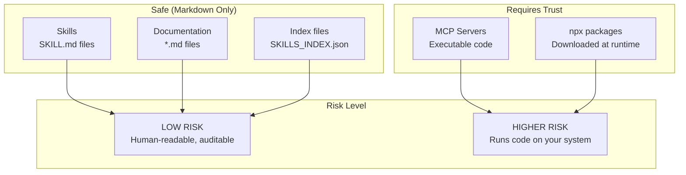

# Security Policy

<div align="center">

## Security Audit Status: PASSED

[]()
[]()
[]()
[]()

</div>

This document outlines the security model for the Rising Tides Skills Pack and provides an audit trail for all included components.

---

## Audit Summary

| Metric | Value |
|--------|-------|
| **Audit Date** | February 15, 2026 |
| **Auditor** | Claude Opus 4.5 |
| **Scope** | All skills, plugins, MCP configurations, scripts |
| **Skills Audited** | 177 |
| **Plugins Audited** | 38 |
| **Scripts Audited** | 19 |
| **MCP Configurations** | 15 |
| **Files Scanned** | 1,100+ |
| **Critical Issues** | 0 |
| **High Issues** | 0 |
| **Medium Issues** | 4 (documented, acceptable) |
| **Low/Informational** | 12 |
| **Overall Status** | **PASS** |

---

## Security Model



### Understanding the Risk Levels

| Component | Type | Risk | Why |
|-----------|------|------|-----|
| **Skills** | Markdown | LOW | Plain text instructions - you can read every line |
| **Documentation** | Markdown | LOW | No executable content |
| **Index files** | JSON | LOW | Just lists and references |
| **MCP Servers** | Executable | MEDIUM-HIGH | Run as separate processes with system access |
| **npx packages** | Downloaded code | MEDIUM-HIGH | Fetched and executed at runtime |

---

## What We Scanned

### File Categories

| Category | Count | Status |
|----------|-------|--------|
| Skill directories | 177 | ✅ Passed |
| Plugin directories | 38 | ✅ Passed |
| MCP configuration files | 15 | ✅ Verified |
| Starter pack scripts | 19 | ✅ Passed |
| Python scripts (in skills) | 72 | ✅ Reviewed |
| Shell scripts (in skills) | 4 | ✅ Reviewed |
| **Total files analyzed** | **1,100+** | ✅ **Audited** |

### Security Checks Performed

| Check | Result | Notes |
|-------|--------|-------|
| Hardcoded real API keys | ✅ PASS | No real credentials found |
| Malicious URLs | ✅ PASS | All URLs are to official sources |
| Data exfiltration | ✅ PASS | No code sends data externally |
| Command injection | ✅ PASS | All scripts use safe patterns |
| Privilege escalation | ✅ PASS | `sudo` only in install docs |
| Unsafe file operations | ✅ PASS | No writes to sensitive locations |
| Unvalidated redirects | ✅ PASS | No redirect handling code |
| Deprecated crypto | ✅ PASS | No weak crypto usage |
| MCP over-permissions | ✅ PASS | All MCPs documented with risks |

---

## Medium Issues (Documented)

| Issue | File | Mitigation |
|-------|------|------------|
| verify=False in TLS | gitops-workflows | Expected for dev clusters with self-signed certs |
| shell=True | webapp-testing | Documented; CLI input from trusted user |
| Placeholder credentials | Multiple docs | Clearly marked as templates |
| Hardcoded user path | memory-plugin | Users customize during setup |

---

## Community Repository Audit

Before including any external skills, we audited 16 community repositories:

### Approved (8 repos)

| Repository | Stars | License | Verdict |
|------------|-------|---------|---------|
| [obra/superpowers](https://github.com/obra/superpowers) | 52,269 | MIT | ✅ SAFE |
| [coreyhaines31/marketingskills](https://github.com/coreyhaines31/marketingskills) | 7,871 | MIT | ✅ SAFE |
| [czlonkowski/n8n-skills](https://github.com/czlonkowski/n8n-skills) | 2,752 | MIT | ✅ SAFE |
| [Jeffallan/claude-skills](https://github.com/Jeffallan/claude-skills) | 2,711 | MIT | ✅ SAFE |
| [lackeyjb/playwright-skill](https://github.com/lackeyjb/playwright-skill) | 1,693 | MIT | ✅ SAFE |
| [antonbabenko/terraform-skill](https://github.com/antonbabenko/terraform-skill) | 1,019 | Apache-2.0 | ✅ SAFE |
| [softaworks/agent-toolkit](https://github.com/softaworks/agent-toolkit) | 592 | MIT | ✅ SAFE |
| [harperaa/secure-claude-skills](https://github.com/harperaa/secure-claude-skills) | 4 | MIT | ✅ SAFE |

### Needs Review (6 repos)

| Repository | Issue |
|------------|-------|
| vercel-labs/agent-skills | No LICENSE file |
| trailofbits/skills | CC-BY-SA-4.0 (ShareAlike clause) |
| ChrisWiles/claude-code-showcase | No LICENSE file |
| rknall/claude-skills | No LICENSE file |
| ahmedasmar/devops-claude-skills | No LICENSE file |
| ko1ynnky/github-actions-mcp-server | No LICENSE, will be archived |

### Rejected (1 repo)

| Repository | Reason |
|------------|--------|
| ckreiling/mcp-server-docker | GPL-3.0 incompatible with MIT distribution |

---

## Approved MCPs Registry

Only use MCPs from verified sources:

| MCP | npm Package | Maintainer | Verified |
|-----|-------------|------------|----------|
| **context7** | `@upstash/context7-mcp` | Upstash | ✅ |
| **playwright** | `@playwright/mcp` | Playwright team | ✅ |
| **shadcn** | `shadcn@latest` | shadcn-ui | ✅ |
| **github-actions** | `github-actions-mcp` | Community | ✅ |
| **n8n** | `n8n-mcp` | Community | ✅ |

### High-Risk MCPs (Use with Caution)

| MCP | Risk | Recommendation |
|-----|------|----------------|
| **docker** | Container runtime access | Sandboxed environments only |
| **github-actions** | CI/CD manipulation | Minimal-scope PAT |
| **n8n** | External system automation | Read-only API key |

### Broken MCP Configurations

The following packages do not exist on public npm:
- `@anthropic-ai/mcp-server-github`
- `@anthropic-ai/mcp-server-memory`
- `@anthropic-ai/mcp-server-remotion`

These may be internal Anthropic packages or planned for future release.

---

## Skill Security

### What Skills Can Do

Skills are **instruction files only**. They:
- Tell Claude how to behave
- Provide domain expertise
- Guide workflows and outputs

Skills **cannot**:
- Execute code directly
- Access files on their own
- Make network requests
- Install anything

### How to Audit a Skill

1. Open the `SKILL.md` file in any text editor
2. Read the content - it's all human-readable markdown
3. Look for the `## Rules` section to understand behavior
4. Check `ATTRIBUTION.md` for the original source

---

## Threat Model

| Threat | Severity | Mitigation |
|--------|----------|------------|
| Malicious skill instructions | Low | Human-readable markdown - audit before use |
| Prompt injection in skills | Low | All skills from known sources with attribution |
| Malicious MCP code | High | Only use approved MCPs from verified publishers |
| Supply chain attack on npm | High | Verify package names; consider pinning versions |
| Typosquatting | Medium | Double-check package names match official sources |
| Memory file exposure | Low | Memory stored locally - review contents periodically |

---

## Best Practices

### For Maximum Security

1. **Review before installing** - Read skill content and verify MCP sources
2. **Use project-level MCPs** - Don't install MCPs globally unless necessary
3. **Pin package versions** - Consider explicit versions instead of `npx -y`
4. **Regular audits** - Periodically review what's installed
5. **Minimal permissions** - Only add MCPs you actually need

### For Balanced Security

1. **Use approved MCPs only** - Stick to the list in this document
2. **Trust but verify** - Spot-check skills occasionally
3. **Keep memory visible** - Desktop location lets you review what Claude knows
4. **Use plugins** - They bundle verified configurations

---

## Reporting Vulnerabilities

If you find a security issue:

1. **For skills:** Open an issue describing the problematic content
2. **For MCPs:** Report to the MCP maintainer (see approved list above)
3. **For this repository:** Contact the repository owner

### Response Timeline

- Skill issues: Review within 48 hours
- Critical MCP issues: Escalate to MCP maintainer immediately
- Documentation updates: Within 1 week

---

## Security Updates

This document will be updated when:
- New MCPs are added to the approved list
- Security issues are discovered and resolved
- Package sources or maintainers change
- New threat vectors are identified

**Last security review:** February 15, 2026

---

## Full Audit Reports

- [Skills Security Audit](SECURITY-AUDIT-SKILLS.md) - Detailed skill findings
- [Plugin Security Audit](SECURITY-AUDIT-PLUGINS.md) - MCP permission analysis
- [Community Repository Audit](SECURITY-AUDIT-COMMUNITY-REPOS.md) - Third-party repo assessments

---

## Incremental Audit Process

When adding new skills, plugins, or MCPs, you only need to audit the new additions — not the entire repository.

### Baseline Audit (February 15, 2026)

The following counts represent the **audited baseline**. Anything beyond these counts requires incremental audit.

| Component | Baseline Count | Baseline Date |
|-----------|----------------|---------------|
| Skills | 177 | 2026-02-15 |
| Plugins | 38 | 2026-02-15 |
| MCP Configurations | 15 | 2026-02-15 |
| Starter Pack Scripts | 19 | 2026-02-15 |
| Python Scripts (in skills) | 72 | 2026-02-15 |
| Shell Scripts (in skills) | 4 | 2026-02-15 |
| Community Repos | 16 | 2026-02-15 |

### How to Perform an Incremental Audit

**Step 1: Identify New Additions**

Compare current counts against baseline:
```bash
# Count current skills
ls -d skills/*/ | wc -l

# Count current plugins
ls -d plugins/*/ | wc -l

# Find skills added after baseline date
find skills/ -name "SKILL.md" -newermt "2026-02-15" -type f
```

**Step 2: Audit New Skills**

For each new skill, check:
- [ ] No hardcoded API keys (search for `sk_live`, `pk_live`, `AKIA`, etc.)
- [ ] No malicious URLs (external curl/wget, suspicious domains)
- [ ] No command injection patterns (`eval`, `exec`, unquoted variables)
- [ ] No data exfiltration (POST to external domains)
- [ ] Source repository has compatible license (MIT, Apache-2.0)

**Step 3: Audit New Plugins**

For each new plugin with MCP configuration:
- [ ] Verify npm package exists: `npm view <package-name>`
- [ ] Check package publisher is legitimate
- [ ] Document required environment variables
- [ ] Classify risk level (LOW/MEDIUM/HIGH/CRITICAL)
- [ ] Add to Approved MCPs Registry if verified

**Step 4: Audit New Scripts**

For any new Python or shell scripts:
- [ ] No `eval()` or `exec()` with user input
- [ ] No `shell=True` without documentation
- [ ] No `verify=False` without justification
- [ ] No `rm -rf` with variables
- [ ] No privilege escalation beyond documented scope

**Step 5: Audit New Community Sources**

For skills from new repositories:
- [ ] Repository exists: `gh repo view owner/repo`
- [ ] License is compatible: `gh api repos/owner/repo/license`
- [ ] No security advisories: `gh api repos/owner/repo/security-advisories`
- [ ] Add to Community Repository Audit with verdict

**Step 6: Update Counts**

After audit passes, update:
1. This file's Audit Summary table
2. This file's Baseline Audit table (new baseline)
3. README.md security metrics
4. Relevant detailed audit reports

### Incremental Audit Log

Record each incremental audit here:

| Date | Auditor | Added | Removed | Result | Notes |
|------|---------|-------|---------|--------|-------|
| 2026-02-15 | Claude Opus 4.5 | Baseline (177 skills, 38 plugins) | — | PASS | Initial comprehensive audit |
| | | | | | |

### Quick Audit Commands

```bash
# Check for hardcoded credentials in new files
grep -rE "(sk_live_|pk_live_|AKIA|api_key_)[a-zA-Z0-9]{16,}" skills/NEW_SKILL/

# Check for dangerous patterns
grep -rE "eval\(|exec\(|shell=True|verify=False" skills/NEW_SKILL/

# Verify npm package exists
npm view @package/name version

# Check GitHub repo license
gh api repos/owner/repo --jq '.license.spdx_id'
```
